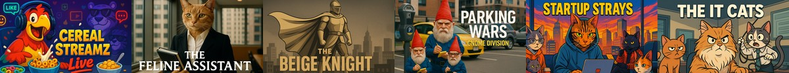

# 🎞️ Scrap TV Feed

[](TV-COLLECTION.md)

**[📺 View Full Collection →](TV-COLLECTION.md)**

[](https://github.com/chris-trag/scrap-tv-feed/blob/main/LICENSE)

A ready-to-use sample TV feed with imaginary shows, complete metadata, and organized assets. Perfect for building app prototypes across any platform or framework.

## 🌟 What's Included

- **Complete Shows** - Videos + poster images with embedded metadata
- **Rich Catalog** - JSON feed with ratings, genres, descriptions, release years
- **Organized Assets** - Standardized file structure ready for CDN deployment
- **Cross-Platform Ready** - Works with React Native, Android, Roku, Web, and more
- **Imaginary Content** - From cereal livestreaming to zombie movie extras

## 📋 Content Categories

- **🐱 Feline-Friendly** - Workplace cats and corporate felines
- **🎨 Beige Studios** - Minimalist lifestyle and meditation content  
- **🧟 Background Character Studios** - Zombie and horror behind-the-scenes
- **⏰ Waiting Room TV** - Patience and mindfulness programming
- **🚗 Parking Channel** - Parking enforcement and spot hunting

## 🚀 Quick Start

### Use the Live Feed
```javascript
const CATALOG_URL = "https://raw.githubusercontent.com/chris-trag/scrap-tv-feed/main/catalog.json";

fetch(CATALOG_URL)
  .then(response => response.json())
  .then(catalog => {
    console.log(`Found ${catalog.items.length} shows`);
    // Build your UI with catalog.items
  });
```

### Filter by Category
```javascript
// Get trending content
const trending = catalog.items.filter(item => item.trending);

// Get comedy shows
const comedy = catalog.items.filter(item => 
  item.genres.includes("Comedy")
);

// Get kid-friendly content
const kidsShows = catalog.items.filter(item => 
  item.content_rating === "TV-G"
);
```

## 🎯 Catalog Structure

Each show includes:
```json
{
  "id": "cereal-streamz",
  "type": "movie",
  "title": "Cereal Streamz", 
  "category": "General",
  "genres": ["Kids", "Reality"],
  "trending": true,
  "rating_count": 4837,
  "rating_stars": 4.0,
  "content_rating": "TV-G",
  "release_year": 2018,
  "description": "Livestreamed cereal tastings with chat interaction...",
  "duration_sec": 10,
  "images": {
    "poster_16x9": "${base_path}/content/cereal-streamz/poster_1920x1080.jpg"
  },
  "sources": [
    {
      "type": "mp4", 
      "url": "${base_path}/content/cereal-streamz/movie_1080p.mp4"
    }
  ]
}
```

## 🔧 Customization

### Change CDN Base URL
Replace `${base_path}` in `catalog.json` with your hosting URL:

```bash
# For GitHub Pages
sed -i 's/${base_path}/https:\/\/username.github.io\/scrap-tv-feed/g' catalog.json

# For your own CDN
sed -i 's/${base_path}/https:\/\/cdn.yoursite.com/g' catalog.json
```

### Host Your Own Copy
1. Fork this repository
2. Enable GitHub Pages in repository settings
3. Update `${base_path}` to your GitHub Pages URL
4. Use `https://username.github.io/scrap-tv-feed/catalog.json`

## 📁 File Structure

```
scrap-tv-feed/
├── catalog.json              # Main feed with all metadata
├── hero-github.jpg           # Hero image for README
├── TV-COLLECTION.md          # Visual catalog with animated previews
├── content/                  # Organized video assets
│   ├── cereal-streamz/
│   │   ├── movie_1080p.mp4
│   │   ├── poster_1920x1080.jpg
│   │   └── preview_animated_1280x720.gif
│   ├── feline-assistant/
│   │   ├── movie_1080p.mp4
│   │   ├── poster_1920x1080.jpg
│   │   └── preview_animated_1280x720.gif
│   └── ...
├── tools/                    # Catalog generation scripts
└── README.md
```

## 🤝 Contributing

Found a bug or want to add more absurd content? See [CONTRIBUTING.md](CONTRIBUTING.md) for guidelines.

## 📄 License

This project is licensed under MIT-0 - see the [LICENSE](LICENSE) file for details.

## 🙏 Acknowledgments

- All content created by [Chris Trag](https://github.com/chris-trag)
- **Tools used**: [Obsidian](https://obsidian.md) for ideation, [Amazon Q CLI](https://aws.amazon.com/q/developer/) for automation, [Wan 2.5](https://github.com/Wan-Video) for video generation, [Amazon Nova Canvas](https://docs.aws.amazon.com/nova/latest/userguide/image-generation.html) for poster creation
- Special thanks to [@giolaq](https://github.com/giolaq) for guidance and advice

---

**Made with 🎬 for developers building the future**
